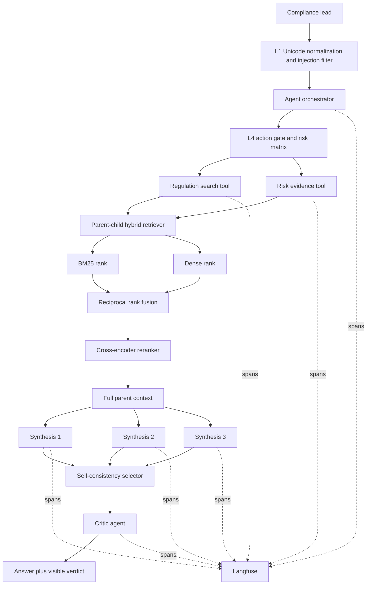

# Architecture

## Components

- `src/agent.py` owns the command-line entry point and run lifecycle. It creates a top-level
  observation, performs two gated retrieval actions, invokes synthesis, and prints the critic
  verdict.
- `src/retrieval.py` splits source documents into overlapping child chunks. BM25 and dense
  rankings are fused with RRF. A cross-encoder reranks the fused shortlist, after which the full
  parent document is supplied as context.
- `src/guardrails.py` implements the L1 filter, L4 gate, shared action risk matrix, argument
  allowlists, and hard `TokenBudget`.
- `src/reasoning.py` contains the few-shot structured prompt, context assembly,
  self-consistency (`k=3`), and independent critic.
- `src/mcp_server.py` exposes three read-only tools over MCP stdio with complete usage contracts
  and safe JSON error handling.

## Non-obvious design decision

The retriever ranks small child chunks but sends their full parent documents to synthesis. Small
chunks improve matching precision, especially for article numbers and narrow obligations, while
parents preserve the surrounding qualifications and exceptions needed for legal research. The
trade-off is higher context use. `assemble_context` therefore imposes a character ceiling, and
`TokenBudget` independently limits total model-call allocation.

## Observability

Every run emits an `agent.run` span, two tool spans, three synthesis generations, and one critic
generation. Each observation includes agent version `0.1.0`. A production alert should trigger
when the critic REVISE rate exceeds 20% over 30 minutes or when p95 run latency exceeds 30
seconds; either condition indicates source drift, model degradation, or retrieval/model-service
failure requiring review.
