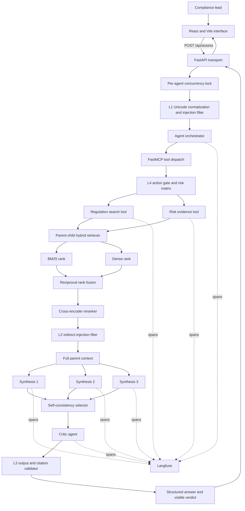

# Architecture

## Components

- `frontend/` provides the typed React/Vite interface, guided scenarios, progressive run state,
  responsive result workspace, critic verdict, run measurements, and official-source inspection.
- `src/api.py` exposes `GET /api/health` and `POST /api/assess`. Its lifespan initializes one
  agent, and an async lock serializes runs because token, cost, and retrieval measurements are
  mutable per-agent state. Guardrail and validation errors become safe client responses. When
  `frontend/dist` exists, the same process serves the production frontend.
- `src/agent.py` owns the command-line entry point and run lifecycle. It creates a top-level
  observation, invokes two registered MCP tools, performs synthesis, and prints the critic
  verdict and AI-use disclosure.
- `src/retrieval.py` splits source documents into overlapping child chunks. BM25 and dense
  rankings are fused with RRF. A cross-encoder reranks the fused shortlist, after which the full
  parent document is supplied as context.
- `src/guardrails.py` implements the L1 input filter, L2 evidence filter, L3 deterministic output
  validator, L4 action gate, shared risk matrix, argument allowlists, and hard `TokenBudget`.
- `src/reasoning.py` contains the few-shot structured prompt, context assembly,
  self-consistency (`k=3`), and independent critic.
- `src/mcp_server.py` exposes three read-only tools over MCP stdio with complete usage contracts
  and safe JSON error handling.

## Web deployment

During development, Vite runs on port 5173 and proxies `/api` to Uvicorn on port 8000. For a
single-process deployment, `npm run build` writes static assets to `frontend/dist`; FastAPI
mounts that directory after registering API routes. The transport does not replace or change
the required `python src/agent.py` grading entry point.

## Non-obvious design decision

The retriever ranks small child chunks but sends their full parent documents to synthesis. Small
chunks improve matching precision, especially for article numbers and narrow obligations, while
parents preserve the surrounding qualifications and exceptions needed for legal research. The
trade-off is higher context use. `assemble_context` therefore imposes a character ceiling, and
`TokenBudget` independently limits total model-call allocation.

## Observability

When Langfuse is configured, every run emits an `agent.run` span, two tool spans, three synthesis
generations, and one critic generation. Each observation includes agent version `0.1.0` and the
system-prompt hash. A production alert should trigger when the critic REVISE rate exceeds 20%
over 30 minutes or when p95 run latency exceeds 30 seconds; either condition indicates source
drift, model degradation, or retrieval/model-service failure requiring review.
